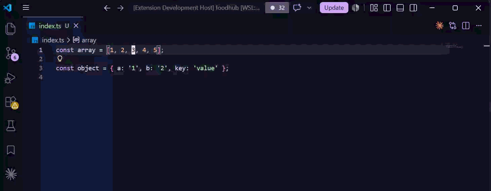

# Tree Join

Toggle, split, and join TypeScript/JavaScript constructs with a single keystroke — a [tree-sitter](https://tree-sitter.github.io/tree-sitter/)-powered, formatter-friendly analogue of [treesj](https://github.com/Wansmer/treesj) for VSCode.

Put your cursor anywhere inside an array, object, function call, parameter list, import, JSX tag, or TypeScript type and flip it between its single-line and multi-line form. Output follows Prettier-compatible defaults, so it stays out of your formatter's way.



## Features

- **One keybinding to toggle** any supported construct: single-line splits, multi-line joins.
- **Tree-sitter accurate** — selection is based on the real syntax tree, not regex, so nested constructs resolve to the innermost one under your cursor.
- **Multi-cursor aware** — every cursor transforms independently and the whole thing lands as a single, atomic undo.
- **Recursive variants** for splitting/joining a construct and all its supported descendants in one shot.
- **Safe joins** — refuses to join when the result would exceed your max line length or would swallow a `//` line comment.
- **Runs in the browser** too — works in [vscode.dev](https://vscode.dev) and [github.dev](https://github.dev).

## Commands

| Command id                 | Title                      | Behavior                                                 |
| -------------------------- | -------------------------- | -------------------------------------------------------- |
| `tree-join.toggle`         | Tree Join: Toggle          | Single-line target → split; multi-line target → join.    |
| `tree-join.split`          | Tree Join: Split           | Force split (no-op if already multi-line).               |
| `tree-join.join`           | Tree Join: Join            | Force join (subject to width / line-comment guards).     |
| `tree-join.splitRecursive` | Tree Join: Split Recursive | Split the target and recurse into supported descendants. |
| `tree-join.joinRecursive`  | Tree Join: Join Recursive  | Join the target and recurse into supported descendants.  |

All commands are available from the Command Palette (`Ctrl/Cmd+Shift+P`). No keybindings are registered by default — see [Keybindings](#keybindings).

## Supported node types

Across `typescript`, `typescriptreact`, `javascript`, and `javascriptreact`:

| Category               | tree-sitter node types                                               |
| ---------------------- | -------------------------------------------------------------------- |
| **Literals**           | `array`, `object`                                                    |
| **Destructuring**      | `array_pattern`, `object_pattern`                                    |
| **Calls & signatures** | `arguments`, `formal_parameters`                                     |
| **Modules**            | `named_imports`, `export_clause`                                     |
| **TypeScript types**   | `type_arguments`, `type_parameters`, `tuple_type`, `object_type`     |
| **JSX**                | attribute list of `jsx_opening_element` / `jsx_self_closing_element` |

Object-like constructs (`object`, `object_pattern`, `object_type`, `named_imports`, `export_clause`) get padded braces on join (`{ a: 1 }`); everything else is unpadded (`[1, 2]`).

## Settings

| Setting                    | Type                                 | Default | Description                                                                                                                            |
| -------------------------- | ------------------------------------ | ------- | -------------------------------------------------------------------------------------------------------------------------------------- |
| `tree-join.maxJoinLength`  | `number`                             | `100`   | Max line length for a join result; longer joins are refused. Set to `0` to use the first `editor.rulers` column (falling back to 100). |
| `tree-join.trailingComma`  | `"add"` \| `"preserve"` \| `"never"` | `"add"` | Trailing comma/separator behavior on split. Join always strips trailing separators.                                                    |
| `tree-join.bracketSpacing` | `boolean`                            | `true`  | Pad inside object-like braces on join (`{ a: 1 }` vs `{a: 1}`).                                                                        |

All three are `language-overridable`, so you can scope them per language (e.g. a different `maxJoinLength` for `typescriptreact`).

## Keybindings

No keys are bound out of the box. To bind toggle to `Alt+Shift+J` in TS/JS files, add this to your `keybindings.json` (**Preferences: Open Keyboard Shortcuts (JSON)**):

```jsonc
{
  "key": "alt+shift+j",
  "command": "tree-join.toggle",
  "when": "editorTextFocus && !editorReadonly && editorLangId =~ /^(typescript|typescriptreact|javascript|javascriptreact)$/",
}
```

Other commands you may want to bind:

```jsonc
[
  {
    "key": "alt+shift+s",
    "command": "tree-join.split",
    "when": "editorTextFocus && editorLangId =~ /^(typescript|typescriptreact|javascript|javascriptreact)$/",
  },
  {
    "key": "alt+shift+k",
    "command": "tree-join.join",
    "when": "editorTextFocus && editorLangId =~ /^(typescript|typescriptreact|javascript|javascriptreact)$/",
  },
]
```

## How it works

Tree Join loads the `web-tree-sitter` WASM runtime plus the TypeScript and TSX grammars on first command invocation. For each cursor it walks up the syntax tree to the innermost supported ancestor, computes the transformed text, and applies all edits in one `WorkspaceEdit` so undo is atomic. Indentation follows the active editor's `tabSize` / `insertSpaces`.

## Contributing

```sh
npm install               # also installs the pre-commit hook via simple-git-hooks
npm run typecheck         # tsc --noEmit (strict)
npm run lint              # eslint .            (lint:fix to auto-fix)
npm run format:check      # prettier --check .  (format to write)
npm run build             # esbuild → dist/extension.js + dist/extension.web.js
npm test                  # vitest: unit + fixture-snapshot suites
npm run test:integration  # @vscode/test-electron smoke suite (needs a display)
npm run test:web          # @vscode/test-web headless browser smoke
npm run package           # vsce package → .vsix
```

Transform behavior is covered by ~300 `*.in.ts`/`*.out.ts` snapshot fixtures under `tests/fixtures/` — see [`tests/fixtures/README.md`](tests/fixtures/README.md). Add a fixture pair (and run `npm run test:update` to record the snapshot) when changing transform output.

CI runs typecheck, lint, format-check, build, unit/fixture tests, the Electron integration smoke, and the headless web smoke on every push and PR.

## License

[MIT](LICENSE) © Eric Newton
